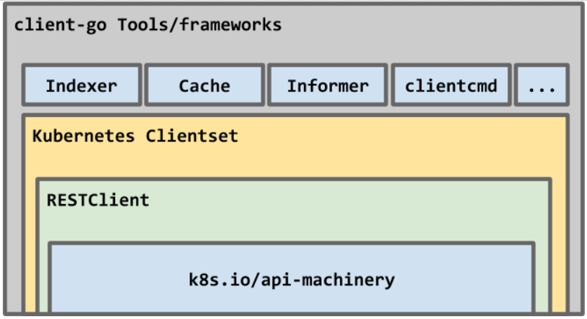
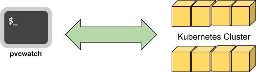

# A simple k8s cli tool for watching PVC

Teaching myself how to write a simple K8S tool using Golang.

References:

- [Building stuff with the K8S APIs](https://medium.com/programming-kubernetes/building-stuff-with-kubernetes-api/home)

## Exploring API objects

I spent almost a year to learn K8S and working with K8S ecosystem. Soon, I realized that there are tons of tools in this
ecosystem. It's pretty overwhelming to decide which tool will be good in which position for beginner like me.

Because I have learned the fundamentals of K8S for a year, now I decided to gain my strength of knowledge about it by
building simple tools for my own purposes.

### K8S is an API-first architecture

Get list of all API's path
```bash
$ kubectl get --raw /
{
  "paths": [
    "/api",
    "/api/v1",
    "/apis",
    ...
    "/ui",
    "/ui/",
    "/version"
  ]
}
```

Example: Get list of Nodes's info
```bash
kubectl get --raw /api/v1/nodes | jq
{
  // A tons of infomations
}
```

The most common tool to working with K8S's APIs is `kubectl`. We can use it to manipulate many resources, it is a good 
example for my first tools.

Note: Most of the time, I use yaml files to define K8S object, but we can also use json files.

### Access to the API server directly

#### Using commend `kubectl proxy`
```bash
$ kubectl proxy --port=8080
Starting to serve on 127.0.0.1:8080
```

Then you can try to use cURL, a browser or your favourite REST tool
```bash
$ curl -XGET http://127.0.0.1/8080/
{
  "paths": [
    "/api",
    "/api/v1",
    "/apis",
...
    "/ui",
    "/ui/",
    "/version"
  ]
}
```

By accessing the K8S's APIs in this way, you don't need to provide authorization credential.

#### Direct server access

If `kubectl proxy` is not your option, you can try access to the API server directly with the proper authorization
credentials.

```bash
API_SERVER=$(kubectl config view -o jsonpath='{.clusters[*].cluster.server}')
TOKEN=$(kubectl get secrets -o jsonpath='{.items[?(@.type=="kubernetes.io/service-account-token")].data.token}' \
    | base64 --decode)
curl $API_SERVER/version --header "Authorization: Bearer $TOKEN" --insecure
```

## Building my first cli tool using Go



We will use `client-go` project. It is the oldest, of the K8S client frameworks, and therefore come with more knobs
and features.

The project is a collection of packages that can accommodate different programming needs from REST-style primitives to
more sophisticated clients.

It's being maintained by [sig-api-machinery](https://github.com/kubernetes/community/tree/master/sig-api-machinery).

## pvcwatch, my first dummy K8S cli tool



The example will highlight several aspects of the K8S Go client including:

- Connectivity

- Resource list retrieval and walk through

- Object watch

The K8S Go client framework supports the ability to watch the cluster for **specified API object lifecycle events**
including `ADDED`, `MODIFIED`, `DELETED`.

For our simple cli tool, we will use this watch ability to monitor and trigger some automated actions (current version
will just log notification to the standard output).
